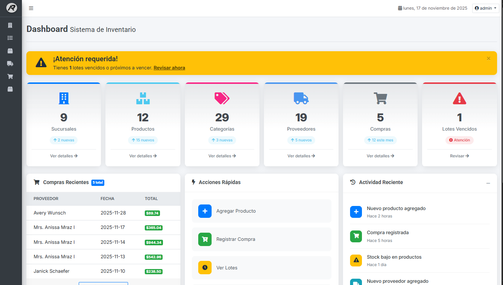
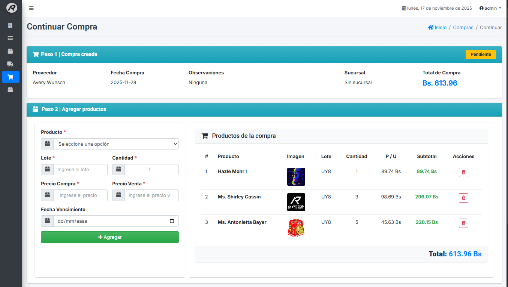
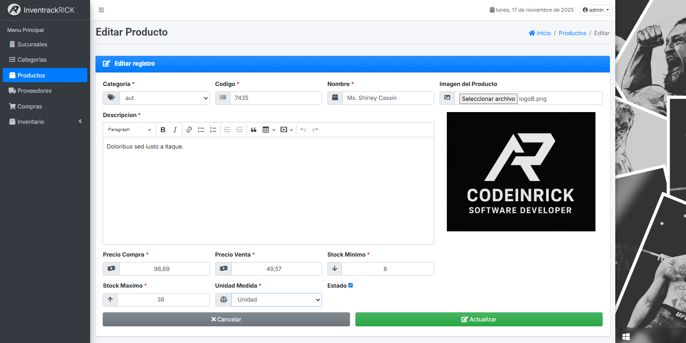
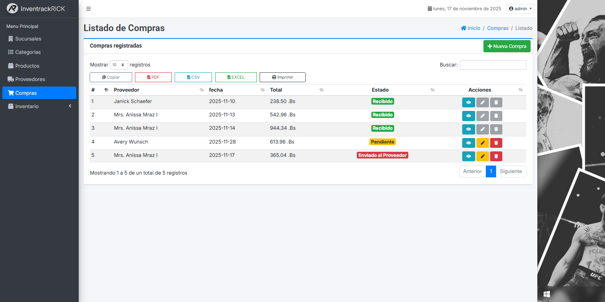
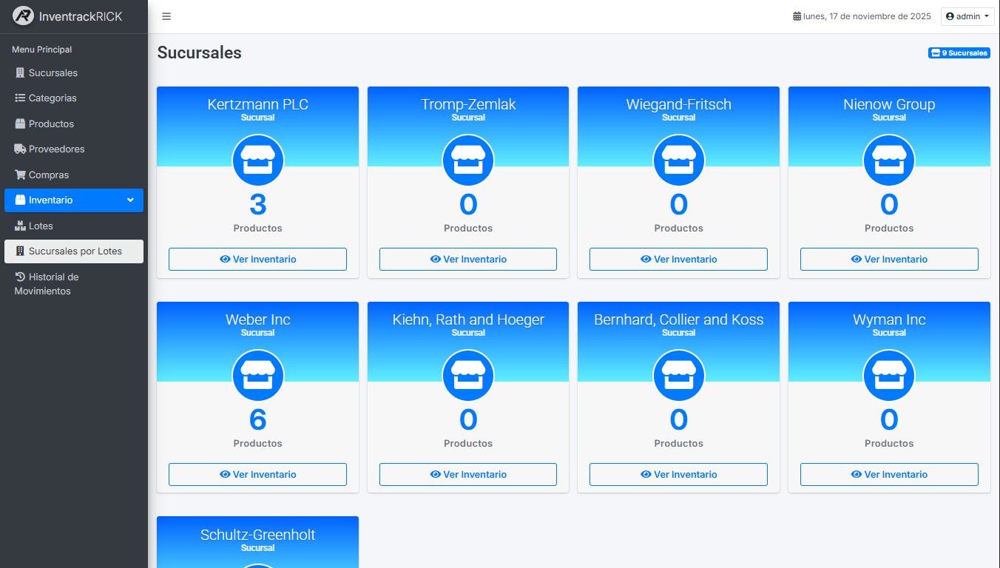
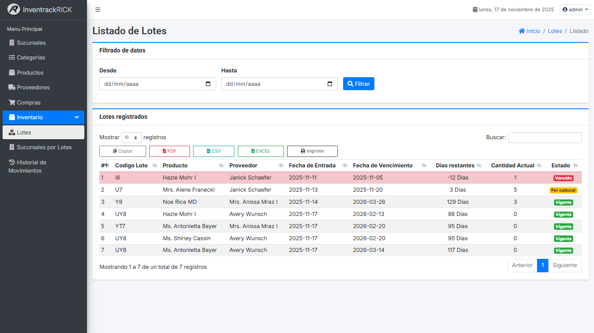

# 📦 Sistema de Inventario – Laravel 12 + AdminLTE + Livewire

**Sistema de Inventario** es una herramienta completa para gestionar productos, lotes, compras, proveedores y sucursales 🏬.  
Incluye panel administrativo, alertas de lotes vencidos, envíos de correo a proveedores y una interfaz moderna gracias a **AdminLTE** y **Livewire** ⚡.

---

## 🚀 Funcionalidades clave

- 🛒 **Gestión de compras:** Registra compras, agrega productos y envía correo al proveedor con **MailTrap**.
- 📦 **Control de productos:** CRUD completo, subida de imágenes y edición fácil.
- 🏷️ **Lotes con control de vencimiento:** Filtrado por fechas, días restantes y alerta de vencidos.
- 🏬 **Sucursales:** Visualiza cuántos productos tiene cada sucursal.
- 📊 **Dashboard dinámico:** Widgets con totales, últimas compras, actividades recientes y más.
- 📧 **Notificaciones:** Envío automático de correo con detalles de la compra y sus productos.

---

## 📸 Capturas de pantalla

### 🏠 Dashboard


Widget de sucursales, productos, compras, lotes vencidos, últimas compras y actividades recientes.

---

### 🛒 Interfaz de Compras


Formulario de compra al lado izquierdo y tabla de productos a la derecha.  
Envío al correo del proveedor.

---

### ✍️ Editar Producto


Subida de imagen y edición completa de datos del producto.

---

### 📋 Lista de Compras


Estados con badges:
- 🟩 Recibido  
- 🟥 Enviado al proveedor  
- 🟨 Pendiente  

---

### 🏬 Sucursales


Muestra todas las sucursales y la cantidad de productos en cada una.

---

### 🗂 Lotes y Vencimientos


Filtro por fechas, lotes próximos a vencer, vencidos y días restantes.

---

## ⚙️ Instalación

1. Clona el repositorio:
    ```bash
    git clone https://github.com/rick672/Sistema-Inventario.git
    ```
2. Instala dependencias:
    ```bash
    composer install
    npm install
    ```
3. Configura tu archivo `.env` (BD, MAILTRAP, APP_KEY, etc).
4. Ejecuta migraciones:
    ```bash
    php artisan migrate --seed
    ```
5. Compila los assets:
    ```bash
    npm run dev
    ```
6. Levanta el servidor local:
    ```bash
    php artisan serve
    ```

---

## 🛠️ Tecnologías usadas

- Laravel 12
- AdminLTE
- Livewire
- MailTrap (envío de correos)
- MySQL
- Bootstrap / AdminLTE UI
- JavaScript

---

## 🌐 Portafolio

Si deseas ver más de mis proyectos, visita mi portafolio:

👉 **https://portafolio-dev-virid.vercel.app/**

---

## 🤝 ¿Quieres colaborar?

1. Haz un **fork** 🍴  
2. Crea una rama (`git checkout -b feature/nuevo-cambio`)  
3. Realiza tus commits (`git commit -m "Descripción del cambio"`)  
4. Empuja tus cambios (`git push origin feature/nuevo-cambio`)  
5. Crea un **Pull Request**  

---

## 📜 Licencia

Este proyecto está bajo la licencia **MIT** — siéntete libre de adaptarlo o mejorarlo 🛡️.

---

## 🙌 Gracias por visitar este proyecto

Hecho con 💙 por **Aliaga Catari**

<p align="center">
  
</p>
